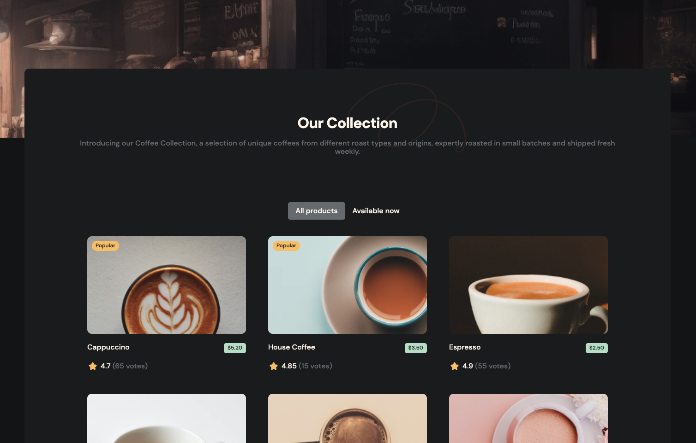

# Simple Coffee list

<div align="center"></div>

Solution proposed for the challenge of the [DevChallenge](https://devchallenges.io/challenge/simple-coffee-listing) platform.

Check the [demo](https://simple-coffee-list-challenge.vercel.app/).

## Todo list

- [x] Create a coffee listing page that matches the given design.
- [x] Use React or other Front-end libraries for this challenge.
- [x] Create a Reusable Card component.
- [x] The card component should include a picture, name, pricing, rating, and number of votes if exists.
- [x] The card component should render popular tag, availability status conditionally.
- [x] Render Coffee list with given data. The data should come from a given API or downloaded JSON file.
- [x] Users can choose to list all products or just available products.
- [x] Deploy the solution and submit Repository URL and Demo URL.

## Stack used

- [Svelte](https://svelte.dev/)
- [SvelteKit](https://kit.svelte.dev/)
- [TypeScript](https://www.typescriptlang.org/)

## Installation

To install the project, you need to have [Node.js](https://nodejs.org/en/) and [Yarn](https://yarnpkg.com/) installed on your computer.

Then, you can clone the repository and install the dependencies:

```sh
yarn install
```

## Usage

To start the project, you can run:

```sh
yarn dev
```

This command starts the development server on [http://localhost:5173](http://localhost:5173).

